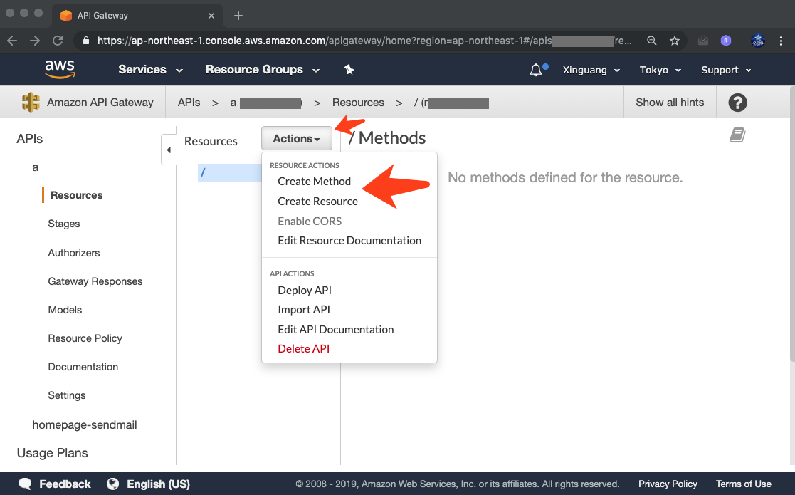

<pre align="center" type="ascii-art">
 _                 _         _                                 _                 _ _ 
| |               | |       | |                               | |               (_) |
| | __ _ _ __ ___ | |__   __| | __ _ ______ ___  ___ _ __   __| |_ __ ___   __ _ _| |
| |/ _` | '_ ` _ \| '_ \ / _` |/ _` |______/ __|/ _ \ '_ \ / _` | '_ ` _ \ / _` | | |
| | (_| | | | | | | |_) | (_| | (_| |      \__ \  __/ | | | (_| | | | | | | (_| | | |
|_|\__,_|_| |_| |_|_.__/ \__,_|\__,_|      |___/\___|_| |_|\__,_|_| |_| |_|\__,_|_|_|
</pre>
# Amazon API Gateway

Amazon API Gateway is an AWS service for creating, publishing, maintaining, monitoring, and securing REST and WebSocket APIs at any scale. 

## Create API Gateway

- Step 1. Go to the Amazon API Gateway Console [CLICK HERE](https://console.aws.amazon.com/apigateway/home)
- Step 2. Sign In into your aws account. And choose a region
  
- Step 3. Click on "Get Started”.
- Step 4. Select `Rest`, `New API`, And enter a API name.
  Then press "Create API"
  
- Step 5. Create Resource and Method.
  
  - Create Resource.
  
  - Create Method.
  
  
  
  
  
  
  
  
