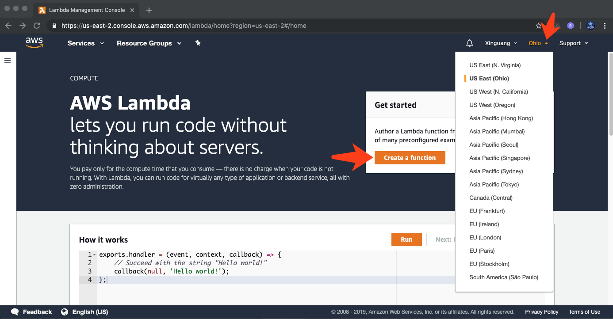
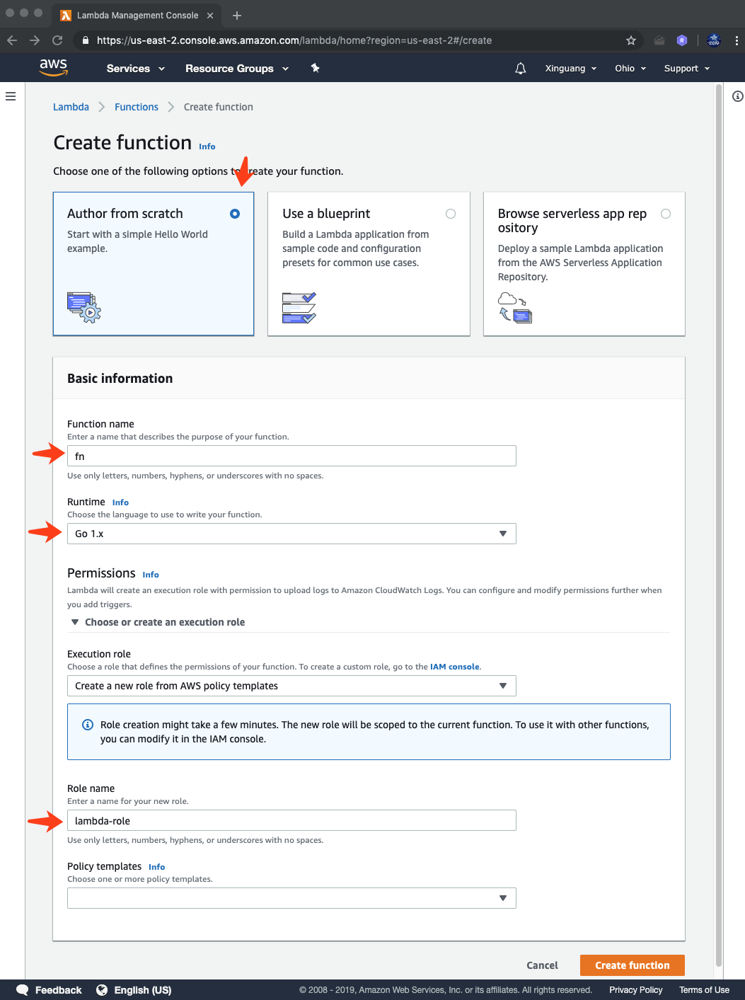
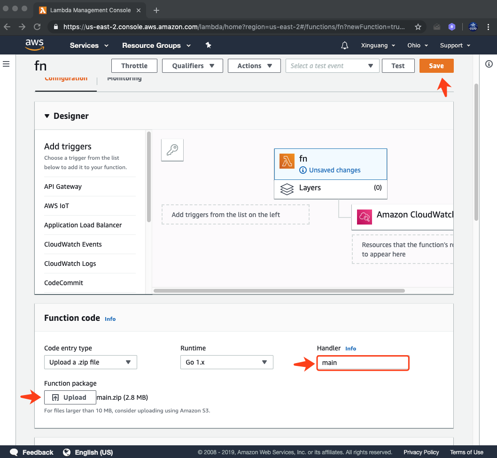
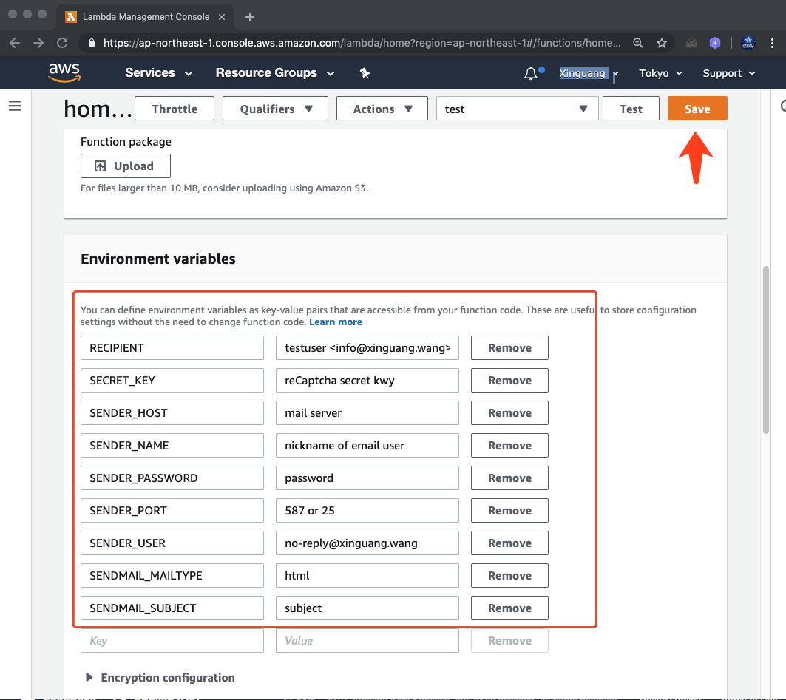

<pre align="center" type="ascii-art">
 _                 _         _                                 _                 _ _ 
| |               | |       | |                               | |               (_) |
| | __ _ _ __ ___ | |__   __| | __ _ ______ ___  ___ _ __   __| |_ __ ___   __ _ _| |
| |/ _` | '_ ` _ \| '_ \ / _` |/ _` |______/ __|/ _ \ '_ \ / _` | '_ ` _ \ / _` | | |
| | (_| | | | | | | |_) | (_| | (_| |      \__ \  __/ | | | (_| | | | | | | (_| | | |
|_|\__,_|_| |_| |_|_.__/ \__,_|\__,_|      |___/\___|_| |_|\__,_|_| |_| |_|\__,_|_|_|
</pre>
# AWS Lambda

AWS Lambda lets you run code without provisioning or managing servers. You pay only for the compute time you consume - there is no charge when your code is not running.

## Create Lambda function

- Step 1. Go to the AWS Lambda Console [CLICK HERE](https://ap-northeast-1.console.aws.amazon.com/lambda/home)
- Step 2. Sign In into your aws account. And choose a region
- Step 3. Click on "Create a Function” orange button at the right side.
  
- Step 4. Select the Author from scratch option, Go1.x runtime, 
  And enter a function name, Role name
  And then press "Create function"
  
- Step 5. upload zip file, and enter the binary file name in `Handler`. And then press "Save" orange button at the top right side.
  
- Step 6. set Environment variables. And then press "Save" orange button at the top 
  
